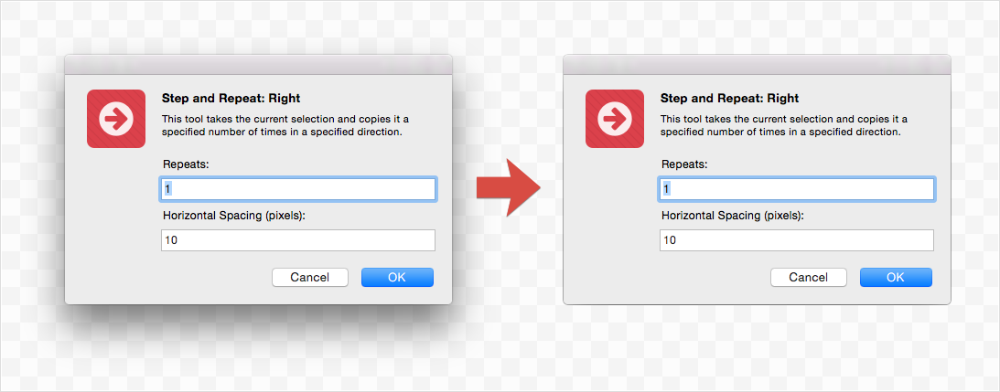

Annotation-Kit
==============
**Work in progress...**

## Shadow Remover Tool

Shadow Remover is a handy tool to quickly remove shadow from a window screenshot. It’s a great companion for anyone who is making documentation, writing articles or preparing presentations. By removing a shadow from your screenshot, it becomes more clear and less cluttered.

With this tool you could easily achieve the following result:

### How To Use

1. Make a Window Screenshot using standard `Ctrl+Shift+Cmd+4`, hover over a window and hit `Space`.
2. Paste it into the page.
3. Select resulting image layer.
4. Hit `Ctrl+A` to remove the shadow.

### Caution

Shadow remover works only with window screenshots that have a certain pattern of bitmap data. It tests several pixels for transparency and color components to be sure that the reference bitmap layer is actually a window screenshot.

The following pixel probes are used during screenshot validation:

This means that Shadow Remover works only with window screenshots that have standard shape and shadow. Popover windows, menus and windows with custom shape are not supported.

## Icon Extractor Tool

Icon Extractor Tool allows to extract contents of icons associated with application bundle or any file system object. It also allows to extract all or specific size representations from Apple `.icns` files or Windows `.ico` file.

This tool has nothing to do with annotations, but anyway I decided to include it in the package, since it's a real helper for designing graphics for documentation, articles or presentation. It's also might be used to quickly grab an icon of desired size and use it as a reference during graphics design process.

### How To Use

1. Launch plugin `Annotation-Kit - > Extract Icon`.
2. Choose application, icon file or any other object you want extract icon from.
3. Hit `Grab Icon!` button.
4. You've just got some icons on your page! :)

> IMPORTANT NOTE: Don't forget that all the icons are belong to their respective owners! :)