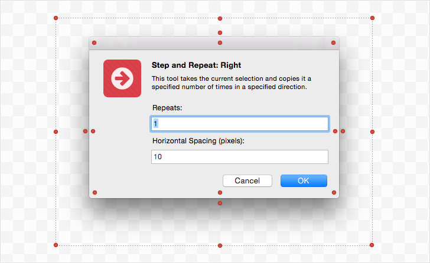
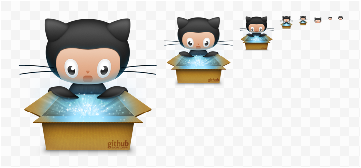

Annotation-Kit
==============

Annotation Kit is a collection of useful tools and plugins for [Sketch App](http://bohemiancoding.com/sketch/) that help with adding annotations to your designs. Currently this package contains just a few tools, but pretty soon it will grow to a full fledged solution.

I will be posting updates in my twitter. Follow me [@turbobabr](https://twitter.com/turbobabr) to stay tuned.

## Installation

1. [Download Annotation-Kit.zip archive file](https://github.com/turbobabr/Annotation-Kit/archive/master.zip).
2. Reveal plugins folder in finder ('Sketch App Menu' -> 'Plugins' -> 'Reveal Plugins Folder...').
3. Copy downloaded zip file to the revealed folder and un-zip it.
4. You are ready to go! :)

**Note: All the plugins in this package work only in Sketch 3.2 Beta**

## Change Log

#### v0.1.0: December 2, 2014

- Initial release with only `Shadow Remover` and `Icon Extractor` tools

## Shadow Remover Tool

Shadow Remover is a handy tool to quickly remove shadow from a window screenshot. It’s a great companion for anyone who is making documentation, writing articles or preparing presentations. By removing a shadow from your screenshot, it becomes more clear and less cluttered.

With this tool you could easily achieve the following result:

### How To Use

1. Make a Window Screenshot using standard `Ctrl+Shift+Cmd+4`, hover over a window and hit `Space`.
2. Paste it into the page.
3. Select resulting image layer.
4. Hit `Ctrl+A` to remove the shadow.

### Caution

Shadow remover works only with window screenshots that have a certain pattern of bitmap data. It tests several pixels for transparency and color components to be sure that the reference bitmap layer is actually a window screenshot.

The following pixel probes are used during screenshot validation:

This means that Shadow Remover works only with window screenshots that have standard shape and shadow. Popover windows, menus and windows with custom shape are not supported.

## Icon Extractor Tool

Icon Extractor Tool allows to extract contents of icons associated with application bundle or any file system object. It also allows to extract all or specific size representations from Apple `.icns` files or Windows `.ico` file.

This tool has nothing to do with annotations, but anyway I decided to include it in the package, since it's a real helper for designing graphics for documentation, articles or presentation. It's also might be used to quickly grab an icon of desired size and use it as a reference during graphics design process.

### How To Use

1. Launch plugin `Annotation-Kit - > Extract Icon`.
2. Choose application, icon file or any other object you want extract icon from.
3. Hit `Grab Icon!` button.
4. You've just got some icons on your page! :)

> IMPORTANT NOTE: Don't forget that all the icons are belong to their respective owners! :)

## Feedback

If you discover any issue or have any suggestions, please [open an issue](https://github.com/turbobabr/annotation-kit/issues) or find me on twitter [@turbobabr](http://twitter.com/turbobabr).

## License

The MIT License (MIT)

Copyright (c) 2014 Andrey Shakhmin

Permission is hereby granted, free of charge, to any person obtaining a copy of this software and associated documentation files (the "Software"), to deal in the Software without restriction, including without limitation the rights to use, copy, modify, merge, publish, distribute, sublicense, and/or sell copies of the Software, and to permit persons to whom the Software is furnished to do so, subject to the following conditions:

The above copyright notice and this permission notice shall be included in all copies or substantial portions of the Software.

THE SOFTWARE IS PROVIDED "AS IS", WITHOUT WARRANTY OF ANY KIND, EXPRESS OR IMPLIED, INCLUDING BUT NOT LIMITED TO THE WARRANTIES OF MERCHANTABILITY, FITNESS FOR A PARTICULAR PURPOSE AND NONINFRINGEMENT. IN NO EVENT SHALL THE AUTHORS OR COPYRIGHT HOLDERS BE LIABLE FOR ANY CLAIM, DAMAGES OR OTHER LIABILITY, WHETHER IN AN ACTION OF CONTRACT, TORT OR OTHERWISE, ARISING FROM, OUT OF OR IN CONNECTION WITH THE SOFTWARE OR THE USE OR OTHER DEALINGS IN THE SOFTWARE.